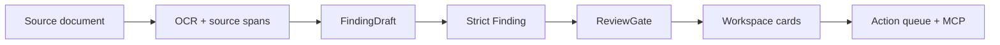

# Murdock

Murdock is a provenance-first legal workflow workspace for turning messy case
documents into reviewable issues, source-backed decisions, and durable follow-up
tasks.

The core bet is simple: legal AI should not be a chat window sitting beside the
work. The documents stay the source of truth, the model drafts narrow
candidates, and the application owns validation, provenance, gates, workflow
state, and auditability.

## Technical TL;DR

- **Runtime:** Next.js 16, TypeScript, Tailwind 4, shadcn/ui.
- **Data layer:** Neon Postgres with Drizzle-style server boundaries and SQL
  repositories under `lib/server/`.
- **AI boundary:** provider calls stay behind `lib/server/ai/` and return typed
  objects through app-owned contracts.
- **Document flow:** upload source, OCR, preserve source spans, extract tolerant
  drafts, compile strict findings, reconcile conflicts, compute review gates,
  project into the workspace.
- **Workflow stance:** the model does not decide legal state, resolve conflicts,
  mutate workflow state, or own follow-through.
- **Connector stance:** MCP exposes bounded case-review tools for Claude Desktop;
  it does not expose raw SQL, raw OCR dumps, transcripts, or internal UUIDs.



## Why This Exists

Legal review work often breaks across PDFs, notes, chats, checklists, and
follow-up tasks. The fragile part is not only extraction. It is keeping a stable
chain from source evidence to issue, human decision, and later action.

Murdock is built around that chain:

```text
document
-> source evidence
-> draft meaning
-> strict finding
-> review gate
-> human decision
-> action queue
-> chat / MCP / UI views over current state
```

This makes the workspace useful for human-in-the-loop legal review rather than
generic document Q&A.

## Harness Architecture

The harness uses a tolerant-reader funnel before commitment.

Provider-facing output is intentionally small. The model emits `FindingDraft`
candidates: compact, source-linked draft meaning that can tolerate legal forms,
tables, alternate naming, and small metadata drift. The app then compiles those
drafts into strict `Finding` records and computes operational consequences in
deterministic code.

Core primitives:

- `SourceSpan`: exact source evidence with document/page/span identity.
- `FindingDraft`: model-facing candidate extraction.
- `Finding`: strict internal operational record.
- `Conflict`: competing source-backed values or interpretations.
- `ReviewGate`: app-computed route for human review.

The current default workflow identity is `harness.v3`. V3 is the MIME-aware
track: uploaded sources should route through source-specific extractors before
they project into canonical findings, conflicts, chronology, review gates,
workspace records, and action queues. Compatibility modes remain available:

```bash
HARNESS_WORKFLOW_VERSION=v1
HARNESS_WORKFLOW_VERSION=v2
HARNESS_WORKFLOW_VERSION=v3
```

Unset defaults to `v3`.

## Product Surface

The main case workspace is intentionally not a table-first admin screen. Review
starts with issue cards because the operator's job is to make judgment calls on
a small number of high-ROI items. A card keeps the issue, source context, summary,
recommended action, and decision affordance in one local frame.

The task queue is separate: it preserves accepted, deferred, or reconciled work
as durable progress memory. A table becomes useful later for bulk assignment,
sorting, filtering, due dates, and large-volume operations. It should not replace
the primary review cards until the user problem is queue management rather than
legal judgment.

The UI contract follows the same boundary:

- rich harness/workspace state stays server-side;
- React receives UI-safe DTOs;
- backend availability or migration details must not leak into legal surfaces;
- provenance is available, but progressively disclosed so the screen stays
  readable during review.

## MCP Connector

Murdock exposes a bounded MCP v1 tool surface at `/api/mcp/v1` so Claude Desktop
can work with the same case source without direct database access.

Typical path:

```text
Claude Desktop
-> scripts/murdock-mcp-stdio.mjs
-> /api/mcp/v1
-> lib/server/mcp/v1
-> case workspace services
```

The MCP layer returns scoped refs such as `action_...`, `issue_...`, `doc_...`,
and `span_...`. Internal database UUIDs, reducer refs, OCR conversion IDs,
document hashes, and raw source span arrays stay behind the service boundary.

Useful first-call tools:

- `get_case_review_digest`: group counts, omitted counts, priorities, and sample
  titles for broad orientation.
- `get_case_review_group`: focused drill-down into one review group.
- `get_roi_review_plan`: bounded next-step options for high-value review.
- `preview_review_transition_plan`: dry-run status changes before writes.

Run the app, then point Claude Desktop at the stdio bridge:

```bash
npm run dev
```

```json
{
  "mcpServers": {
    "murdock": {
      "command": "node",
      "args": ["/Users/prateek/code/murdock/scripts/murdock-mcp-stdio.mjs"]
    }
  }
}
```

By default the bridge calls `http://localhost:3000/api/mcp/v1`. Set
`MURDOCK_MCP_HTTP_URL` only when pointing Claude at a deployed app.

## Key Engineering Decisions

### Strict state after tolerant extraction

Early attempts to make the model emit dense app-owned schemas were brittle:
provider tool calls returned empty inputs, alternate dialects, and schema misses.
The current harness keeps provider output small, parses tolerant drafts, and
commits only strict app-validated records.

### One extraction pass, deterministic projection

The workspace does not call a second model to reshape the same matter. Once
source-backed findings exist, downstream facts, issues, gates, cards, queues, and
MCP views are projections over typed state.

### Architecture over prompt wording

Missing source information becomes `null`, `missing`, `unclear`, or
`unsupported`. Conflicts are preserved instead of guessed through. Review gates
are computed by the app, not delegated to the model.

### Quiet legal UX over telemetry UI

The case screen should feel like an evolving matter, not an orchestration
dashboard. Importance is communicated through hierarchy, grouping, source
disclosure, and action availability rather than warning-heavy labels.

### Opaque connector refs

External clients get stable MCP-scoped references. Raw tables, source arrays,
provider payloads, and internal identifiers do not cross the connector boundary.

## Repository Map

```text
app/                         Next.js routes, server actions, public/app shells
components/                  shadcn/Tailwind UI components
db/migrations/               Postgres migrations
lib/contracts/               Zod schemas, DTOs, cross-layer types
lib/server/adapters/         Stateless external API adapters
lib/server/ai/               Provider-neutral model boundary
lib/server/case-workspace/   Case workspace loading and projection
lib/server/harness/          OCR-to-findings harness workflows
lib/server/mcp/              Bounded MCP service surface
lib/server/telemetry/        Langfuse/OpenTelemetry setup
scripts/                     Local/demo/deployment utilities
tests/                       Vitest E2E and harness checks
```

## Local Development

```bash
npm install
npm run dev
```

Open `http://localhost:3000`.

Required for server-backed features:

```bash
NEON_CONN_URL=
MISTRAL_API_KEY=
ANTHROPIC_API_KEY=
ANTHROPIC_MODEL=
```

Shared demo identity:

```bash
MURDOCK_DEMO_USER_ID=dev-user
MURDOCK_DEMO_FIRM_ID=dev-firm
MURDOCK_DEMO_DISPLAY_NAME="Demo user"
```

Optional tracing:

```bash
LANGFUSE_PUBLIC_KEY=
LANGFUSE_SECRET_KEY=
LANGFUSE_BASE_URL=https://cloud.langfuse.com
LANGFUSE_TRACING_ENVIRONMENT=development
LANGFUSE_RELEASE=
OTEL_SERVICE_NAME=murdock
```

## Checks

```bash
npm run audit:lean
npm test
npm run lint
npx tsc --noEmit
npm run build
```

Real OCR plus model E2E is opt-in:

```bash
RUN_HARNESS_E2E=1 npx vitest run tests/harness-e2e.test.ts --testTimeout 240000
```

## Current Scope

This is a working MVP slice, not a general legal operating system. In scope:

- source-backed document review;
- review cards and durable action queues;
- provenance-aware chat over current case context;
- bounded Claude Desktop MCP connector;
- demo deployment path.

Out of scope for this slice:

- autonomous legal decisions;
- external legal research;
- court filing automation;
- broad practice-area status machines;
- raw database access through MCP.
